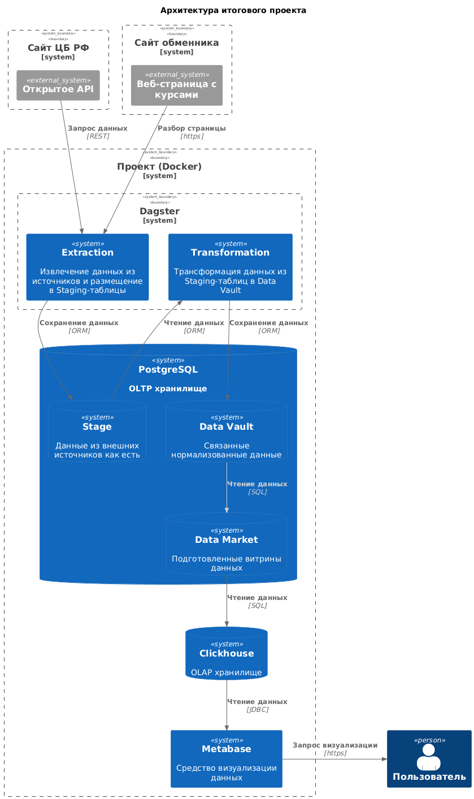

# Выпускной проект курса "Data Engineer" от OTUS

## Задача

Организовать сбор курса доллара к рублю с сайта ЦБ РФ (референсный курс, устанавливаемый Центральным Банком по итогам внебиржевых торгов, курс устанавливается каждый торговый длень на следующие дни до нового торгового дня) и обменника Лиговка (известный пункт обмена наличной валюты в Санкт-Петербурге с большим выбором валют и достаточно близкими к биржевым торгам курсам валют, курсы меняются несколько раз в течение суток), хранение этих курсов в хранилище построенном по принципу Data Vault 2.0 для более простого добавления новых источников данных и валютных пар, а также визуализация собранных курсов.

## Архитектура проекта



## Особенности реализации

Проект запускается на сервере в защищенной инфраструктуре: доступ из Интернета к серверу закрыт, у сервера есть доступ в Интернет.

Используемые инструменты и технологии:

* **Ubuntu** — операционная система на основе Linux, используется в качестве ОС на сервере (версия 24.04) и базового образа для ClickHouse (версия 22.04);
* **Alpine 3.21.3** — минималистичный Linux-дистрибутив на базе musl и BusyBox, оптимизированный для контейнеров и встраиваемых систем благодаря небольшому размеру и повышенной безопасности, используется в качестве базового образа для Dagster, ClickHouse Keeper и Metabase.
* **Bookworm** - кодовое имя Debian 12, стабильного релиза популярного Linux-дистрибутива, используется в качестве базового образа для PostgreSQL, так как сборка на основе Alpine содержит множество известных критических уязвимостей;
* **Docker 28.2** — платформа для создания, развертывания и управления приложениями в изолированных контейнерах, используется для запуска приложений независимо друг от друга, упрощения управления приложениями и их зависимостями;
* **PostgreSQL 17.5** - объектно-реляционная система управления базами данных (ORDBMS) с открытым исходным кодом, поддерживающая сложные запросы, транзакции ACID и множество типов данных (JSON, геометрические, сетевые и др.). Используется для хранения системных данных Dagster и Metabase, а также как OLTP-база для собранных из источников данных.
* **ClickHouse 25.4** - высокопроизводительная колоночная СУБД для OLAP, оптимизирована для аналитики в реальном времени: обрабатывает триллионы строк за секунды благодаря хранению данных по столбцам и эффективному сжатию. Используется для хранения данных для аналитических запросов, в том числе, визуализации;
* **ClickHouse Keeper 25.4** — сервис координации и управления для ClickHouse, обеспечивающий отказоустойчивость и согласованность данных в распределённых кластерах.
* **Dagster 1.10.14** — это оркестратор данных для построения ETL/ELT-пайплайнов, управления ML-моделями и мониторинга активов (датасетов, файлов). Используется для запуска скриптов, отвечающих за сбор и обработку данных, а также визуализации результатов запуска.
* **Python 3.12** - язык программирования общего назначения, используется для написания обработчиков данных в Dagster;
* **Cursor AI 1.0.0** — интеллектуальный редактор кода на базе ИИ (форк VS Code). Автоматизирует написание, рефакторинг и отладку, понимает контекст проекта, генерирует код по описанию на естественном языке и даже создает многофайловые приложения. Используется как IDE для всего проекта.
* **Git 2.45** — распределённая система контроля версий, позволяющая отслеживать изменения в исходном коде, координировать работу команды разработчиков и откатываться к предыдущим версиям проекта при необходимости. Используется для управления версиями кода проекта в ходе разработки.
* **GitHub** — крупнейшая облачная платформа для совместной разработки и хостинга IT-проектов на основе Git, предоставляющая инструменты для контроля версий, управления задачами и командной работы, включая репозитории, пул-реквесты и интеграцию с CI/CD. Используется для хранения кода вне локальной машины, в том числе для сдачи проекта.
* **Metabase 0.54.5.3** - open-source BI-инструмент для визуализации данных с низким порогом входа. Позволяет создавать дашборды и запросы через UI или SQL, поддерживает интеграцию с PostgreSQL, MySQL и другими СУБД. Используется для визуализации данных.

### Dagster

Версия Dagster 1.10.14 на основе образа python:3.12-alpine c хранением настроек в базе PostgreSQL, и подключением пользовательского кода в виде внешнего тома для удобства отладки и внесения изменений.

#### Сбор данных

1. Используется два asset:

* **fetch_usd_rate_from_ligovka** - сбор цен купли и продажи USD при обмене от $1000 с сайта ligovka.ru;
* **fetch_usd_rate_from_cbr** - сбор референсного курса USDRUB на следующий день через API ЦБ РФ:

2. Созданы раздельные расписания:

* для **fetch_usd_rate_from_ligovka** - запуск каждые три часа, так как обновления происходят нерегулярно;
* для **fetch_usd_rate_from_cbr** - запуск каждый день в 19:00 по московскому времени.

3. Asset'ы имеют следующие возможности:

* при необходимости создание таблицы, куда осуществляется запись, sql-процедура вынесена в константу для надежности;
* обработка ошибок для случаев, когда курс недоступен;
* правильное протоколирование всех операций;
* возвращение метаданных с курсом и датой в случае успеха;
* используют общие параметры подключения к базе данных;

4. Asset'ы будут:

* возвращать пустой результат MaterializeResult, если ставка недоступна;
* выводить предупреждения об ошибках HTTP;
* заносить в журнал ошибки при любых других исключениях;
* сохранять курс в базе данных только тогда, когда он доступен.

#### Нормализация данных

1. Используется два asset:

* **load_cbr_data_to_dv** зависит от **fetch_usd_rate_from_cbr**, переносит в Data Vault данные от ЦБ РФ;
* **load_ligovka_data_to_dv** зависит от **fetch_usd_rate_from_ligovka**, переносит в Data Vault данные от обменника Лиговка;

2. Отдельного расписания нет, запускается после завершения работы вышестоящего asset.

3. Обработка данных:

* Для ЦБ РФ создается одна запись с типом курса 'reference';
* Для обменника Лиговка создаются две записи: 'buy' и 'sell';

4. Оптимизация:

* Загружаются только новые данные (сравнение по timestamp);
* Используются UPSERT операции для предотвращения дублирования, дубликаты игнорируются;
* Хеш-ключи генерируются на основе бизнес-ключей.

5. Обработка ошибок:

* Все операции выполняются в транзакции;
* Логирование ошибок и успешных операций;
* Корректное закрытие соединений.

6. Масштабируемость:

* Структура позволяет легко добавлять новые источники;
* Поддерживается историчность данных;
* Сохраняются все метаданные.

#### Подготовка данных

1. Используется один asset:

* **create_data_marketing_views** зависит от **load_cbr_data_to_dv** и **load_ligovka_data_to_dv**, обеспечивает наличие представления с витриной данных и доступ к этому представлению ClickHouse.

2. Отдельного расписания нет, запускается после завершения работы любого из вышестоящих asset.

### PostgreSQL

Официальный образ PostgreSQL 17.5-bookworm с указанием логина и пароля для администратора, а также ограничением выделенных ресурсов.

### ClickHouse

2 экземпляра ClickHouse с использованием 3 выделенных ClickHouse Keeper: 1 шард с репликацией между clickhouse-01 и clickhouse-02. Версия 25.4.

Информацию о терминологии, конфигурации и тестировании можно найти [в документации](https://clickhouse.com/docs/en/architecture/replication).

#### Загрузка данных

На любой реплике кластера ClickHouse выполнить следующий запрос:

```sql
CREATE NAMED COLLECTION postgres_creds_2 ON CLUSTER cluster_1S_2R AS
host='postgres',
port='5432',
db='data_db',
user=...,
password=...,
schema='data_marketing';
```

Затем создать представление в ClickHouse, получающее данные из PostgreSQL:

```sql
CREATE VIEW default.exchange_rates ON CLUSTER cluster_1S_2R
AS SELECT * FROM postgresql(postgres_creds, table='vw_exchange_rate_value');
```

<mark>Не смог заставить заработать named_collection, прописанные в конфигурационном файле /etc/clickhouse-server/config.d/named_collections.xml</mark>

### Metabase

Официальный образ MetaBase v0.54.5.3 c хранением настроек в базе PostgreSQL.

#### Визуализация данных

Настроить подключение к любой реплике ClickHouse, подготовить дашборд на основе имеющихся данных.
